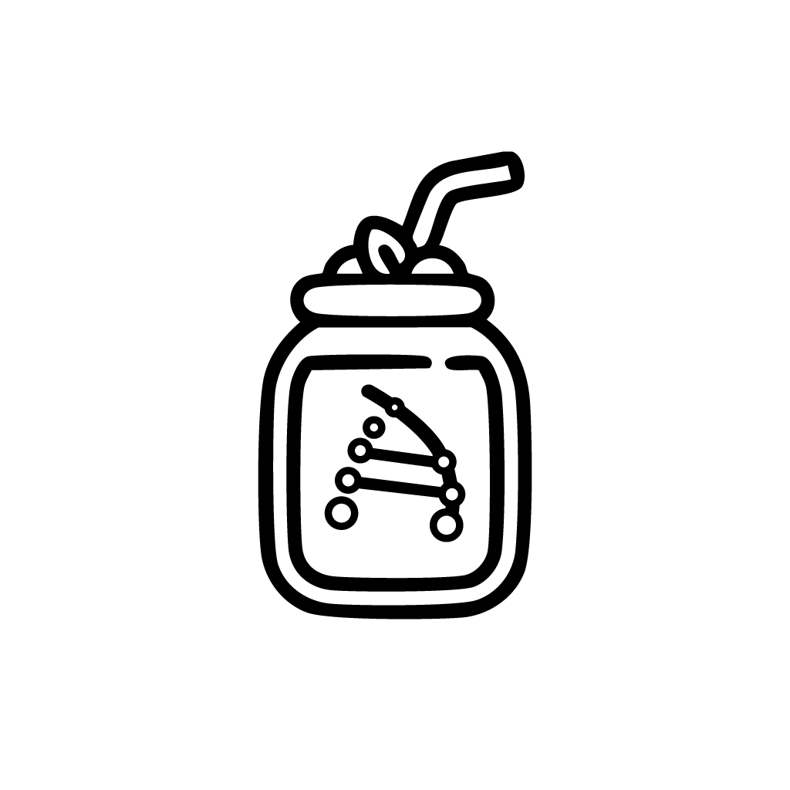

<p align="center">
  
</p>

<h1 align="center">📦 Anaboli Order App</h1>

<p align="center">
  <strong>Gestión de pedidos simple y eficiente</strong>
</p>

<p align="center">
  
  
  
  
  
</p>

<p align="center">
  
</p>

---

## 📱 Screenshots

<p align="center">
  
  &nbsp;&nbsp;
  
  &nbsp;&nbsp;
  
  
</p>

---

## ✨ Características

<table>
  <tr>
    <td align="center">📋</td>
    <td><strong>Gestión de Pedidos</strong><br>Crea, edita y elimina pedidos de forma intuitiva</td>
    <td align="center">🔍</td>
    <td><strong>Búsqueda Avanzada</strong><br>Filtra por gimnasio, producto o estado</td>
  </tr>
  <tr>
    <td align="center">📊</td>
    <td><strong>Analíticas</strong><br>Visualiza estadísticas y métricas de tus pedidos</td>
    <td align="center">🌓</td>
    <td><strong>Tema Oscuro/Claro</strong><br>Soporte completo para ambos modos</td>
  </tr>
  <tr>
    <td align="center">💾</td>
    <td><strong>Persistencia Local</strong><br>Datos almacenados de forma segura con AsyncStorage</td>
    <td align="center">📤</td>
    <td><strong>Exportar/Importar</strong><br>Comparte y respalda tus datos en JSON</td>
  </tr>
  <tr>
    <td align="center">🎨</td>
    <td><strong>UI Moderna</strong><br>Animaciones fluidas con Reanimated</td>
    <td align="center">📱</td>
    <td><strong>Multiplataforma</strong><br>Funciona en iOS, Android y Web</td>
  </tr>
</table>

---

## 🚀 Inicio Rápido

### Prerrequisitos

- [Node.js](https://nodejs.org/) (v18 o superior)
- [Bun](https://bun.sh/) (recomendado) o npm/yarn
- [Expo CLI](https://docs.expo.dev/get-started/installation/)
- iOS: [Xcode](https://developer.apple.com/xcode/) (solo macOS)
- Android: [Android Studio](https://developer.android.com/studio)

### Instalación

```bash
# Clonar el repositorio
git clone https://github.com/tu-usuario/anaboli-order-app.git

# Navegar al directorio
cd anaboli-order-app

# Instalar dependencias
bun install
# o
npm install
```

### Ejecutar la App

```bash
# Iniciar servidor de desarrollo
bun start

# Ejecutar en iOS
bun run ios

# Ejecutar en Android
bun run android

# Ejecutar en Web
bun run web
```

---

## 🏗️ Estructura del Proyecto

```
📦 anaboli-order-app
├── 📂 app/                    # Pantallas (Expo Router)
│   ├── 📂 (tabs)/             # Navegación por tabs
│   │   ├── index.tsx          # Lista de pedidos
│   │   ├── new-order.tsx      # Crear nuevo pedido
│   │   ├── analytics.tsx      # Analíticas
│   │   └── settings.tsx       # Configuración
│   └── _layout.tsx            # Layout principal
├── 📂 components/             # Componentes reutilizables
│   ├── OrderCard.tsx          # Tarjeta de pedido
│   ├── FilterSheet.tsx        # Bottom sheet de filtros
│   ├── StatusBadge.tsx        # Badge de estado
│   └── ...
├── 📂 store/                  # Estado global (Zustand)
│   ├── orderStore.ts          # Store de pedidos
│   └── themeStore.ts          # Store del tema
├── 📂 constants/              # Constantes y tema
│   └── theme.ts               # Colores, fuentes, tamaños
├── 📂 types/                  # Tipos TypeScript
│   └── index.ts               # Definiciones de tipos
├── 📂 hooks/                  # Custom hooks
├── 📂 services/               # Servicios
├── 📂 assets/                 # Recursos estáticos
│   ├── 📂 fonts/              # Fuentes personalizadas
│   └── 📂 images/             # Imágenes e iconos
├── 📂 android/                # Código nativo Android
└── 📂 ios/                    # Código nativo iOS
```

---

## 📦 Tipos de Datos

### Producto

```typescript
type ProductType = "A" | "GNY" | "C" | "K";

interface Product {
  type: ProductType;
  quantity: number;
}
```

### Pedido

```typescript
type OrderStatus = "Entregado" | "Entregado + P" | "Entregado + TRF";

interface Order {
  id: string;
  gymName: string;
  products: Product[];
  status: OrderStatus;
  notes?: string;
  price?: number;
  createdAt: string;
  updatedAt: string;
}
```

---

## 🛠️ Tech Stack

| Categoría          | Tecnología                                                                                             |
| ------------------ | ------------------------------------------------------------------------------------------------------ |
| **Framework**      | [Expo](https://expo.dev/) ~52.0.0                                                                      |
| **UI**             | [React Native](https://reactnative.dev/) 0.76.9                                                        |
| **Navegación**     | [Expo Router](https://docs.expo.dev/router/introduction/)                                              |
| **Estado**         | [Zustand](https://zustand-demo.pmnd.rs/)                                                               |
| **Animaciones**    | [React Native Reanimated](https://docs.swmansion.com/react-native-reanimated/)                         |
| **Gestos**         | [React Native Gesture Handler](https://docs.swmansion.com/react-native-gesture-handler/)               |
| **Bottom Sheet**   | [@gorhom/bottom-sheet](https://gorhom.github.io/react-native-bottom-sheet/)                            |
| **Iconos**         | [Lucide React Native](https://lucide.dev/)                                                             |
| **Fuentes**        | [Inter](https://fonts.google.com/specimen/Inter), [Poppins](https://fonts.google.com/specimen/Poppins) |
| **Fechas**         | [date-fns](https://date-fns.org/)                                                                      |
| **Almacenamiento** | [AsyncStorage](https://react-native-async-storage.github.io/async-storage/)                            |

---

## 📜 Scripts Disponibles

| Comando                 | Descripción                              |
| ----------------------- | ---------------------------------------- |
| `bun start`             | Inicia el servidor de desarrollo de Expo |
| `bun run android`       | Ejecuta la app en Android                |
| `bun run ios`           | Ejecuta la app en iOS                    |
| `bun run web`           | Ejecuta la app en el navegador           |
| `bun run lint`          | Ejecuta el linter                        |
| `bun test`              | Ejecuta los tests                        |
| `bun run reset-project` | Reinicia el proyecto                     |

---

## 🔧 Build de Producción

### Android (APK/AAB)

```bash
# APK de debug
cd android && ./gradlew assembleDebug

# AAB para Play Store
cd android && ./gradlew bundleRelease

# APK de release
cd android && ./gradlew assembleRelease
```

### iOS

```bash
# Build con EAS
eas build --platform ios
```

### Con EAS Build

```bash
# Build para ambas plataformas
eas build --platform all

# Build de desarrollo
eas build --profile development

# Build de preview
eas build --profile preview
```

---

## 🤝 Contribuir

¡Las contribuciones son bienvenidas! Por favor, sigue estos pasos:

1. 🍴 Haz fork del proyecto
2. 🌿 Crea una rama para tu feature (`git checkout -b feature/AmazingFeature`)
3. 💾 Haz commit de tus cambios (`git commit -m 'Add: AmazingFeature'`)
4. 📤 Haz push a la rama (`git push origin feature/AmazingFeature`)
5. 🔃 Abre un Pull Request

---

## 📄 Licencia

Este proyecto está bajo la Licencia MIT. Ver el archivo [LICENSE](LICENSE) para más detalles.

---

<p align="center">
  Hecho con ❤️ usando <a href="https://expo.dev/">Expo</a> y <a href="https://reactnative.dev/">React Native</a>
</p>

<p align="center">
  <a href="#-order-app">⬆️ Volver arriba</a>
</p>
